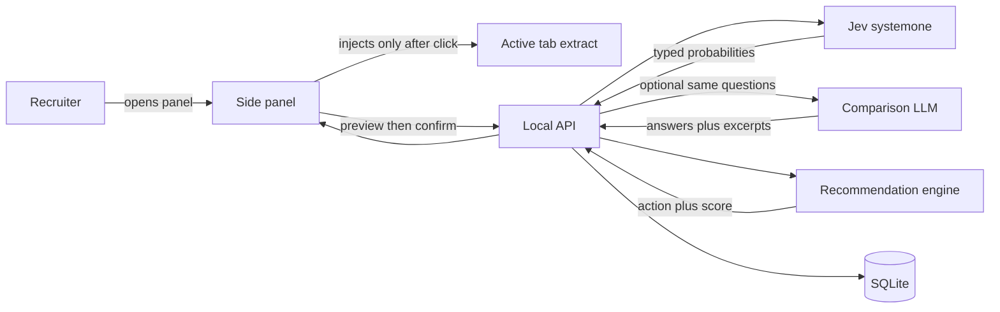

# Decision Assistant MVP

This is a local educational backbone, not a paid product. The recruiter flow is the use case that makes the comparison concrete: one approved profile, one rubric, two models, one decision made by code.

The repo is empty aside from [.vscode/settings.json](.vscode/settings.json).

## What Jev is

Jev is TypeSafe AI’s System One model (`jev-1.13.0`, alias `jev-latest`). It is not a chat model.

- Sampling is parallel. One request returns every answer together. It does not generate tokens one by one.
- It does not write text, excerpts, or outreach.
- You send `state` plus typed `questions`. It returns a choice, a score, or a yes/no probability (`noul`), each with a probability distribution and a confidence.
- Endpoint: `POST https://api.typesafe.ai/v1/systemone`.
- Published price: **$0.042 per million input tokens**. Output tokens are reported and cost $0. Those output counts are not comparable to an LLM’s generated tokens; the sidebar must say so.
- A value outside the options you defined cannot come back. A wrong option inside that set still can. There is no paper and no open weight file, so calibration is TypeSafe’s claim.

The official recommendation uses Jev’s answers plus the local policy. The LLM never picks that action.

## Architecture

Monorepo (pnpm, TypeScript, Vitest):

- [packages/domain](packages/domain) — schemas, Jev question mapping, safety scan, recommendation policy, score, and cost math. No network.
- [apps/api](apps/api) — Hono on localhost, Drizzle, SQLite file at `data/decision-assistant.db`.
- [apps/extension](apps/extension) — WXT, React, Manifest V3 side panel.

`TYPESAFE_API_KEY` and the LLM key live only in server env. The extension talks to localhost. It never sees provider keys.

No accounts and no Postgres. One person, one machine. `EVALUATIONS_ENABLED=false` still stops new provider calls immediately.

## Permissions and privacy

Extension permissions: `sidePanel`, `activeTab`, `scripting`, `storage`, plus host access only to the local API origin.

No content script on all URLs. The toolbar click opens the side panel and grants temporary `activeTab` access. Extraction runs through `chrome.scripting.executeScript` then. The panel shows the extract. Nothing is uploaded until the recruiter deletes unwanted sections and confirms Evaluate.

Raw page text is not stored unless a local “keep extracts” switch is on. Stored rows keep the recommendation, Jev probabilities, grounded LLM excerpts when that call ran, and the usage snapshot. The user can delete one row or the whole history.

## Two model calls

### Jev, one parallel request

All criteria go in a single `questions` map. Do not send one HTTP call per criterion.

- Requirement, preference, and disqualifier: `choice` with `match`, `mismatch`, `no_evidence`, `contradictory`.
- Seniority: `score` with levels `below`, `aligned`, `above`, `unclear`.
- `state` is only the approved profile text. The question text lives on the question, not inside `state`.

Map the response into `CriterionAnswer`: `criterionId`, `result`, `confidence`, `probabilities`, `excerpt: null`. Jev has no excerpt. The UI says that in the Jev column instead of inventing a quote.

### LLM, two jobs an autoregressive model can do

`LlmProvider` is a chat model. The first implementation is Anthropic, selected by env, so it can be swapped.

1. **Rubric draft**, once per role. Jev cannot write criterion text. The draft is editable. Criteria that mention a protected attribute are dropped and the omission is shown. This token cost is shown on the role, not on every candidate.
2. **Comparison call**, optional, default on, same questions and same approved text. The model returns the same result enum plus a verbatim excerpt. An excerpt that is not a normalized substring of the approved text fails that side only.

The comparison call is the fair pairing: same state, same questions, structured answers. It is not a prompt that asks the model to write the hiring decision.

## Cost panel

Each side stores `modelId`, `inputTokens`, `outputTokens`, and the price row used at call time.

- Jev dollars = `inputTokens * 0.042 / 1_000_000`. Output dollars are 0.
- LLM dollars = input and output tokens times that model’s configured prices.
- The panel shows tokens in, tokens out, estimated dollars, and the dollar gap.
- A one-line note states that Jev output tokens are not generated text and are not billed.
- History sums the snapshots. Later price edits do not rewrite old rows.

A failed Jev call shows an error and no recommendation. A failed comparison call still shows the Jev result and marks the LLM meter as unavailable. The comparison must not be required for the decision.

## Validation and policy

Jev validation fails the evaluation when the payload is not the schema, a criterion is missing or duplicated, a choice is outside the option set, or confidence is outside 0–1. Timeout and transport errors do the same. No partial recommendation.

LLM excerpt validation fails only the comparison side.

Safety scan rejects protected or sensitive attributes in criteria and in any generated text: race, ethnicity, religion, gender, sexual orientation, age, disability, health, family, pregnancy, politics, personality, cultural fit.

Application code in [packages/domain/src/recommend.ts](packages/domain/src/recommend.ts) maps Jev answers to the action. `policyVersion` starts at `1`. Default `CONFIDENCE_THRESHOLD` is `0.75`.

A required or seniority answer is **unconfirmed** when its result is `no_evidence` or `contradictory`, or its confidence is below the threshold. Missing evidence is unconfirmed, not a mismatch.

1. Kill switch off, invalid Jev output, or Jev timeout → error, no action.
2. Any required or seniority criterion is unconfirmed, or a disqualifier is contradictory or below threshold → **Investigate**.
3. A disqualifier is a confident `match`, or a required criterion is a confident `mismatch` → **Skip**.
4. Every required and seniority criterion is a confident `match`, and every preference is a confident `match` → **Contact**.
5. Every required and seniority criterion is a confident `match`, and some preference is not → **Save for later**.

Role-fit score is 0–100 and does not change the action. Required and seniority matches count fully. Preferences count at half weight. Unconfirmed and mismatch contribute 0.

Each requirement row shows the criterion, the Jev result, the confidence, and the probability distribution. The excerpt cell on the Jev side reads “Jev does not return text.” When the comparison ran and the excerpt checked out, that quote appears on the LLM side. Otherwise the LLM side reads “No evidence found.”

Server abort is 10s. Client abort is 12s. The panel shows Extracting, Review, then Evaluating. Jev itself is expected in well under a second; the LLM comparison is the slow call. Retries send the same `Idempotency-Key` and return the original row.

Every row records `rubricVersionId`, the versioned model id Jev actually returned (not the `jev-latest` alias), the LLM model id when used, and `policyVersion`.

## Data model

SQLite tables:

- `roles` — title, job description, rubric-draft token snapshot
- `rubric_versions` — criteria JSON, version, `approvedAt`
- `evaluations` — idempotency key, Jev answers, recommendation, score, optional LLM answers, both usage snapshots, versions
- `corrections` — overridden action or criterion results, plus a note; the original row stays

Criterion shape: `id`, `label`, `question`, `kind` (`requirement | preference | disqualifier | seniority`). Editing an approved rubric creates a new version. The sidebar selects the active approved role.

## Product surfaces

**Roles.** Paste a job description, draft a rubric with the LLM, edit kinds and wording, approve.

**Evaluate.** Capture the visible page with a generic reader plus small LinkedIn and GitHub adapters. Preview, delete sections, evaluate. Show the four-way Jev result. A Jev failure is an error state with no action.

**Cost.** Two meters on the result, and a running total on the history list.

**Recruiter actions.** Record Contact, Investigate, Save, or Skip, including an override. Add a note. Nothing is sent to a candidate or an ATS.

**Deletion.** Delete one evaluation or all local history.

Keyboard: open the panel, move through the extract, confirm evaluate, and move among the four actions without a pointer.

## Out of this backbone

Accounts, billing, Postgres, outreach drafting, ATS export, automatic LinkedIn browsing, bulk scraping, connection requests, sending messages, pool ranking, hiring or rejection decisions, and background monitoring. Outreach needs a writing model and can be a later slice; Jev will not draft it.

## Verification

Unit tests cover the policy, the Jev-to-answer mapping, and the cost formula: missing evidence → Investigate; confident required mismatch → Skip; contradiction → Investigate; Jev output tokens add $0; LLM output tokens add the configured output price; a price change does not alter a stored snapshot.

API tests use a fake Jev client and a fake LLM client. Extraction is tested with saved HTML fixtures. Then load the unpacked extension against the local API: no capture before the click, preview editing, a Jev recommendation, an LLM meter when the comparison is on, a Jev failure with no action, and a history total that matches the stored snapshots.
